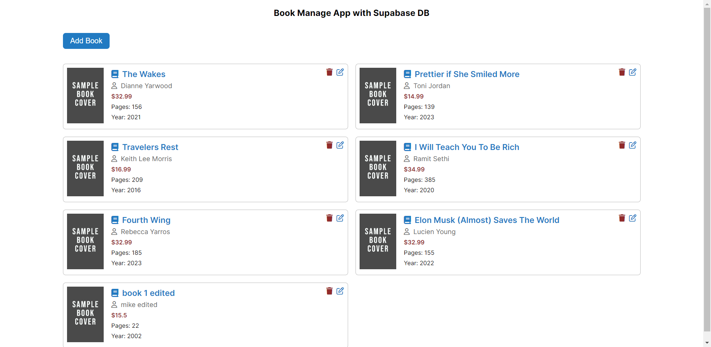

# Book Manage App with React + Supabase Database

- To use api url create a **.env** file in project folder and create these environment variable 

```
VITE_DB_URL=<DB_URL>
VITE_API_KEY=<API_KEY> 
```

**Screenshot**

